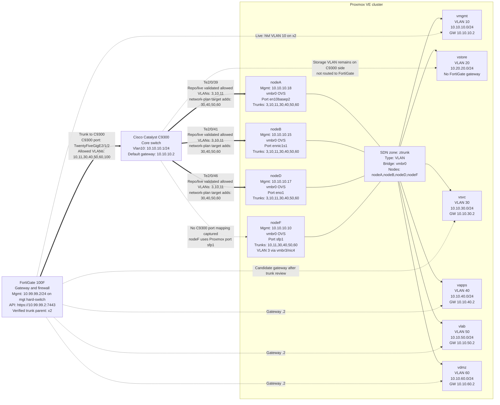

# Current Network Diagram

Generated from the repo state on 2026-05-28.

Primary sources:

- `data/network-plan.json`
- `configs/cisco-c9300-iosxe.cfg`
- `configs/fortigate-100f-vlan-cli.conf`
- `configs/proxmox-sdn-pvesh.sh`
- `session-handoff.md`

## Topology

## VLAN And VNet Map

| VLAN | Name | Purpose | Subnet | Gateway | Proxmox VNet |
|---:|---|---|---|---|---|
| 10 | PROXMOX_MGMT | Proxmox management | 10.10.10.0/24 | 10.10.10.2 | vmgmt |
| 20 | STORAGE_CEPH | Storage / Ceph | 10.20.20.0/24 | none on FortiGate | vstore |
| 30 | VM_SERVICES | VM services | 10.10.30.0/24 | 10.10.30.2 | vsvc |
| 40 | CONTAINERS_APPS | Containers / apps | 10.10.40.0/24 | 10.10.40.2 | vapps |
| 50 | LAB_TEST | Lab / test | 10.10.50.0/24 | 10.10.50.2 | vlab |
| 60 | DMZ | DMZ / public-facing | 10.10.60.0/24 | 10.10.60.2 | vdmz |
| 99 | INFRA_MGMT | Infrastructure management | 10.99.99.0/24 | 10.99.99.2 | none |

## Current Review Notes

- FortiGate VLAN candidate config now uses verified parent `x2`.
- FortiGate API was verified at `https://10.99.99.2:7443`.
- FortiGate parent trunk interface was verified as `x2`.
- Live FortiGate VLAN interfaces on `x2`: `hlvl` VLAN 10 (`10.10.10.2/24`), `k8s` VLAN 11 (`10.11.11.2/24`), and `Wifi` VLAN 100 (`10.100.100.2/24`).
- FortiGate tracks VLAN 10 by live name `hlvl` and does not create `VLAN10_PROXMOX_MGMT`.
- VLAN 99 stays on existing `mgt` hard-switch using `10.99.99.2/24`; do not create a VLAN 99 interface.
- VLAN 20 remains on the C9300/storage side and is not routed to the FortiGate.
- FortiGate candidate VLAN interface names use short FortiOS-safe names: `vsvc`, `vapps`, `vlab`, and `vdmz`.
- The C9300 FortiGate trunk target preserves VLANs `10,11,100` and adds routed VLANs `30,40,50,60` for FortiGate gateway reachability.
- `configs/cisco-c9300-iosxe.cfg` and `session-handoff.md` show Proxmox-facing C9300 trunks allowing `3,10,11`; `data/network-plan.json` now records the expanded target `3,10,11,30,40,50,60`.
- Proxmox SDN is represented as applied cluster-wide in `session-handoff.md`: zone `ztrunk` plus VNets `vmgmt`, `vstore`, `vsvc`, `vapps`, `vlab`, and `vdmz`.
- `vinfra` / VLAN 99 is intentionally not created in Proxmox.
